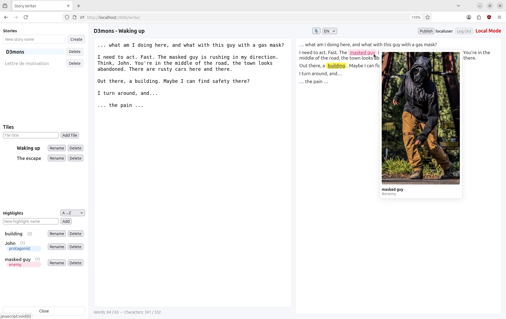
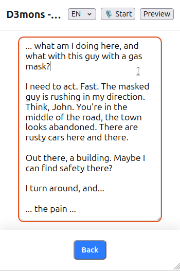

# Writer — Story Editor



A small editor for story writers, inspired by **Ghostwriter**. Because I felt **Scrivener** and **Manuskript** too feature-rich for my taste.

> 🚨 I made a leaner / better version of that editor, check it out: [NeoWriter](https://github.com/valvolt/neowriter)

## Test it online
- you will need to register a user
- you have a small quota
- the server runs on http. It's not super secure, remember it's just for testing
- try it here: http://46.225.219.90:3000/

## Run it
```
git clone https://github.com/valvolt/writer.git
cd writer
docker compose up --build
```
Open http://localhost:3000/

## Host it
By default, the server runs in Local Mode (no authentication, single user). To enable user authentication and multi-user management, do as follows:

- create a .env file that you position in the root folder, as follows:

```
AUTH0_AUTH_REQUIRED=false
AUTH0_AUTH0LOGOUT=true
SECRET=<put an arbitrary long string here>
AUTH0_BASEURL=
AUTH0_CLIENT_ID=
AUTH0_ISSUER_BASE_URL=https://
PORT=3000
```

- register or login to auth0.com
  - Create a simple Application for an Express web application
  - Copy and paste the Client ID to the AUTH0_CLIENT_ID field in .env
  - Copy and paste the Domain to the AUTH0_ISSUER_BASE_URL field in .env (after https://)
- set AUTH0_BASEURL to the URL where you are hosting the application (if on your local machine, that's http://localhost:3000)

Start the server with docker compose. The system will parse the .env file and enable user management.

## Writing your story

Type 'my story' and click Create

### Tiles

Tiles are text sections. The first tile, named 'Chapter 1', is auto-generated and selected so that you can type right away. This tile, and all other tiles, can be renamed.

You can type your story in the editor window. Text will be rendered on the right panel. The editor supports some markdown elements such as headers, non-numbered lists, italic and bold.

Type '# Chapter One'

Create a second tile named 'Chapter 2'. Select it by clicking on it.

Type '# Chapter Two'

Click on 'my story'. The rendering pane should say 'Chapter one' then 'Chapter two'.

Drag and drop tile 'Chapter 2' on top of tile 'Chapter 1'. See how the rendering pane now says 'Chapter two' then 'Chapter one'.

The tile system is how you can break your story in chunk and reorganize them any way you want.

Note how at the bottom you can see the total number of words and characters you typed. The left number is the total number. The right number relates to the current tile.

### Highlights

Highlights are sub-pages, notes outside of the story, that you can use to manage anything you need to manage: characters, locations, items, etc.

There are two ways to create a highlight. Let's explore both.

Option 1: contextual menu

- Click on tile Chapter 1.
- Below the text 'Chapter One', type Alice meets with Bob in the forrest.
- With the mouse, select 'Alice' and do a right-click. Click 'Make "Alice" a highlight'.
- See how a new Highlight named Alice appeared.
- See how the word 'Alice' is now underscored in the rendering pane of Chapter 1.


Option 2: input field

- In the left menu, enter 'Bob' under Highlights and click Add
- See how a new Highlight named Bob appeared.
- See how the word 'Bob' is now underscored in the rendering pane of Chapter 1.

- Choose whatever approach you prefer to create a highlight named 'forrest'.

### tags

Tags are namely used to manage highlight.

- Click 'Alice'. In the editor, type #character (no space after the hash sign!)
- Do the same with 'Bob'.
- For 'forrest', use tag #location

Click the tile 'Chapter 1', see how the words Alice, Bob and forrest are now rendered.

In the left menu, click tag 'location'. See how the forrest now appears on top. If you want all characters to be on top, simply click tag 'character'

You can also order highlights by alphabetical order, or by number of times they appear in the story.

If you remove all occurrences of a highlight, you can delete that highlight (a delete button will appear)

If you rename a highlight, it will rename all its occurences in the text. This can be useful if you want to rename a character, for example.

You can also use tags in the text of the tiles, for example to mark a text as 'draft'. The story tags will appear on the top banner.

### images

You can upload images anywhere, just right-click and select 'Upload image...'. The image will be rendered on the right pane.

- Upload an image for Alice.
- Click tile 'Chapter one'
- Hover your move over the word 'Alice'. Notice that the image is rendered there.

Images can illustrate your stories, or help you remember who is who and what is what when it comes to highlights.

### links

You can insert hyperlinks anywhere, just right-click and select 'Insert link...'. The hyperlink will be rendered on the right pane. The link will open in a new tab.

If you select text prior to right-clicking, this text will be used as the link.

### speech-to-text

If used from a Chrome-based browser (on a computer or on an Android phone), you can write by talking. Select your language and click the microphone icon. Speak normally. Click the icon again when you're done. Voice can be used for capturing text only, it can't be used to perform any other action such as formatting.

## Publishing

Only you can see the stories you are working on. You can click 'Publish' to make your story public. It can then be read by anyone (no need to authenticate). It is not possible to 'unpublish' a story as of today. Please note that when you publish a story, all images will be copied over to the published folder (and thus take space on disk)

## On the disk

All content is auto-saved with each keystroke.

The structure is as follows:
```
story\
  username\
    my-story\
      tiles\
        tile1.md
        tile2.md
        tiles.json
      highlights\
        highlight1.md
        highlight2.md
        highlights.json
      images\
        image1.png
      published\
        image1.png
        my-story.md
```

You will find folder 'my story' under 'stories'. Browse the files there to retrieve your text in md files and your uploaded images.

Clicking 'Delete' in the UI next to 'my story' and confirming will delete all text and uploaded files from your disk (including its published version).

## Rendering capabilities

Besides highlights and and keywords, the following markdown-inspired syntax is supported:

| Syntax (raw) | Renders as |
| --- | --- |
| `# Heading 1` | Heading level 1 (rendered as a heading) |
| `*italic*` | *italic* |
| `**bold**` | **bold** |
| `~~strikethrough~~` | ~~strikethrough~~ |
| `* Item` | • Item (bullet list) |
| `  * Sub-item` | ⚬ Sub-item (nested) |
| `> Quote` | > Quote (blockquote) |
| `- [ ] Task item` | ◻️ Task item |
| `- [X] Task item` | ☑️ Task item (checked) |
| `` |  |
| `...` | … (ellipsis) |
| `--` | — (em-dash) |
| `"quotes"` | “quotes” |
| `---` | (horizontal line) |
| `* * *` | ✦ ✦ ✦ (centered line) |
| `->` | → (arrow) |
| `<=` | ⇐ (double arrow) |

## Mobile mode

When used from a phone, the screen will switch to a phone-friendly, simplified UI. Some features (such as re-arranging Tiles) are not available in mobile mode. Speech-to-text will work only on Android phone, from Chrome-based browser. Turn your phone horizontally to switch back to the desktop-friendly UI.

